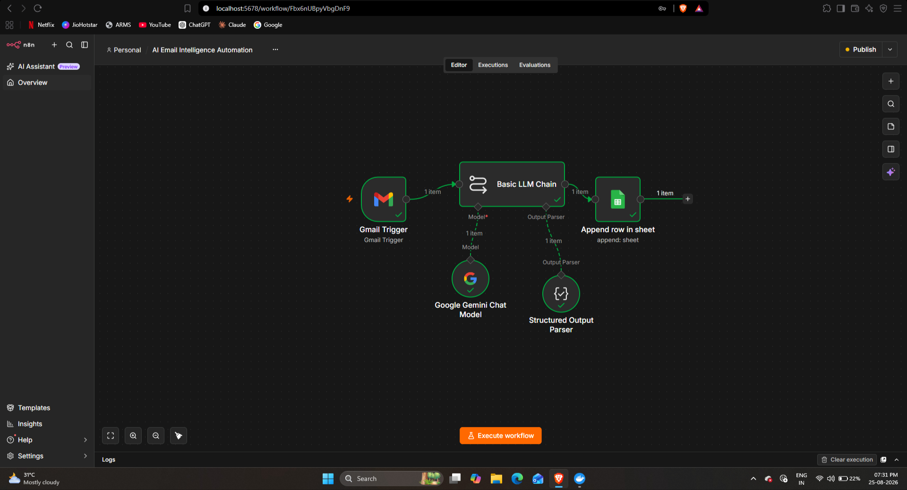
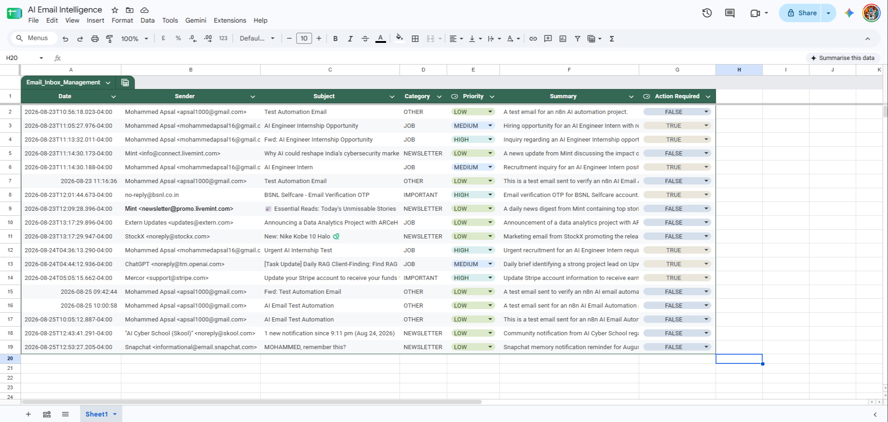

# AI Email Intelligence Automation with n8n

AI-powered email intelligence automation built with **n8n** and **Google Gemini** to classify emails, determine priority, generate summaries, identify action items, and store insights in **Google Sheets**.

## Workflow



## How It Works

1. **Gmail Trigger** receives a new email.
2. **Google Gemini** analyzes the email content.
3. The AI classifies the email and determines its priority.
4. The AI generates a summary and identifies action items.
5. **Structured Output Parser** formats the AI response.
6. **Google Sheets** stores the processed email information.

## Technologies

- n8n
- Gmail
- Google Gemini
- Google Sheets
- Structured Output Parser

## Google Sheets Output



## Project Structure

```text
ai-email-intelligence-n8n
│
├── README.md
├── AI Email Intelligence Automation.json
│
└── screenshots
    ├── workflow.png
    └── google-sheets.png
Use Cases
Email classification
Priority detection
Customer support automation
Sales email processing
Action-item extraction
Email summarization
Business email management
Setup
Download the AI Email Intelligence Automation.json workflow.
Import it into n8n.
Connect your Gmail account.
Configure your Google Gemini credentials.
Connect your Google Sheets account.
Select your destination Google Sheet.
Test the workflow with a new email.

Note: Credentials and API keys are not included in this repository. Configure your own credentials inside n8n.

Author

Mohammed Apsal

AI Automation | Generative AI | n8n | AI Agents
